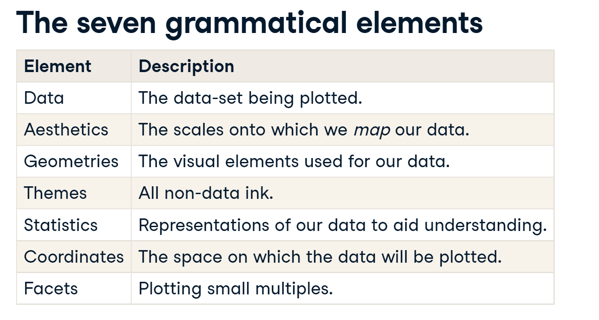
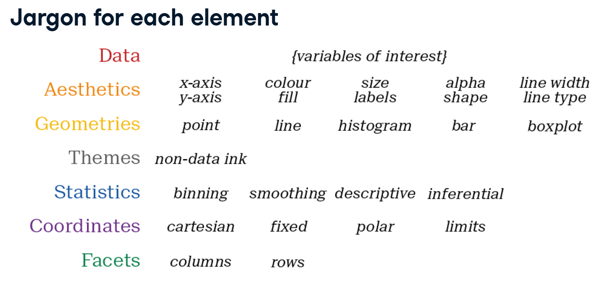
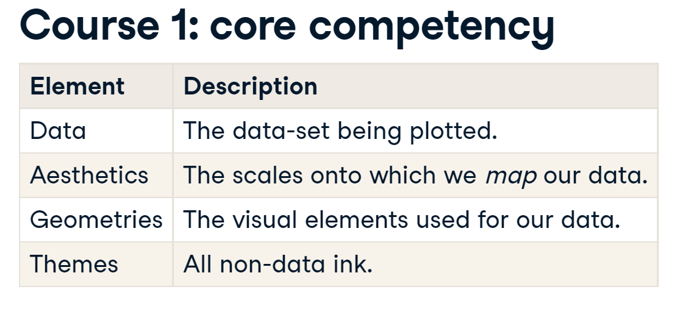
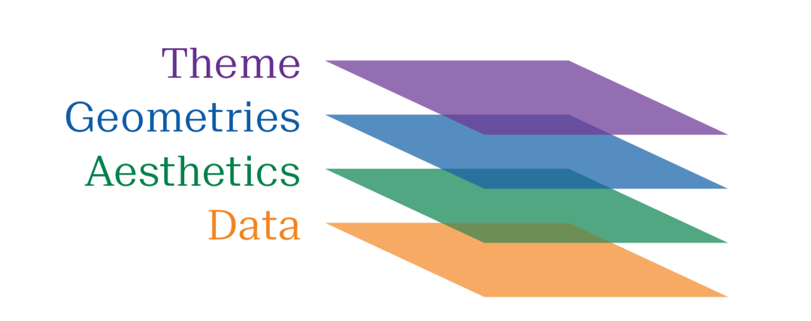
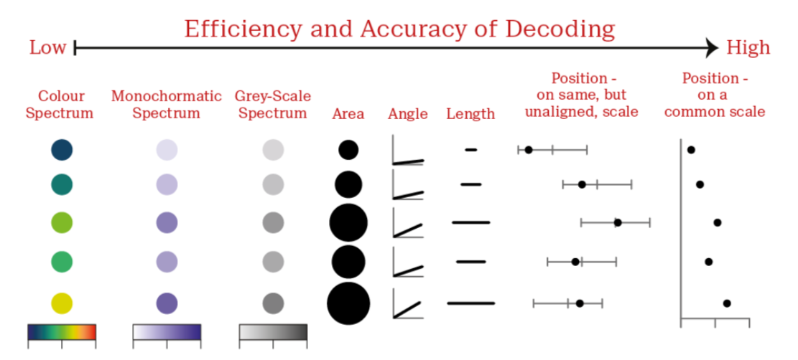
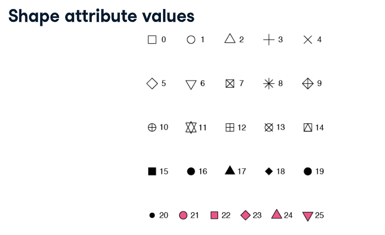

```{r setup, include=FALSE}
knitr::opts_chunk$set(echo = TRUE, message=FALSE, warning=FALSE)

# Load the ggplot2 package
require(ggplot2)
require(tidyverse)
```

# Introdução

Ggplot é chamado de gramática dos gráficos. Há sete elementos nessa gramática. Imagine uma frase. Cada parte tem sua função gramatical que pretende transmitir uma determinada mensagem.

No livro The Grammar of Graphics, Leland Wilkinson, traz dois princípios:

-   Gráficos são construídos por distintas camadas de elementos gráficos;

-   Insights significativos são construídos com 'aesthetic mapping'

Há 7 elementos dessa gramática visual:

{width="800"}

O jargão de cada elemento pode ser visto abaixo:

{width="800"}

Para este curso vamos considerar os seguintes elementos:

{width="800"}

## Mtcars: descrição

```{r}
# Load the ggplot2 package
# require(ggplot2)

# Explore the mtcars data frame with str()
str(mtcars)

# Vamos criar alguns fatores na base para criar visualizações mais atraentes
# Using am as a factor
mtcars_mod <- 
  mtcars %>% 
  mutate(fam = factor(am), 
         fcyl = factor(cyl))

levels(mtcars_mod$fam) <- c("automatic", "manual")
```

Dicionário:

matcars é um quadro de dados contendo 32 objetos e 11 variáveis, incluindo mpg,cyl,disp,hp ,drat,wt,qsec,vs,am,gear,carb.

1.  mpg: Milhas/(EUA) galão

2.  cyl: Número de cilindros

3.  disp: Deslocamento

4.  hp: potência bruta

5.  drat: Relação do eixo traseiro

6.  wt: Peso (1000 lbs)

7.  qseg: tempo de 1/4 de milha

8.  vs: V/S

9.  am: (0=automática, 1=manual)

10. gear: Número de marchas para a frente

11. carb: Número de carburadores

## Gráficos

### Basic: Consumo vs. Cilindrada

```{r}
# Execute the following command
ggplot(mtcars, aes(cyl, mpg)) +
  geom_point()
```

### Color: Peso vs. Consumo

```{r}
# Change the color aesthetic to a size aesthetic
ggplot(mtcars, aes(wt, mpg, color = disp)) +
  geom_point()
```

### Size: Tamanho: Por autonomia

```{r}
# Change the color aesthetic to a size aesthetic
ggplot(mtcars_mod, aes(wt, mpg, size = disp)) +
  geom_point()
```

### Shape: Tamanho: Por autonomia

```{r include=TRUE}
ggplot(mtcars_mod, aes(wt, mpg, shape = fam)) +
  geom_point()
```

## Ggplot e suas camadas

Temos 4 camadas para trabalhar:

1.  Data: a tabela de dados que queremos construir um gráfico;
2.  Aesthetics: São os elementos de coordenadas;
3.  Geometries: É o tipo de gráfico;
4.  Theme: É o tema que escolheremos para o gráfico.



De outro modo, temos os dados (data), precisamos mapeá-lo (aesthetics) e escolher o melhor tipo de gráfico (geometries) e pensar no melhor tema (theme).

### Gráfico usando smooth

```{r}
ggplot(diamonds, aes(carat, price)) +
  geom_point() +
  geom_smooth()
```

### Gráfico usando alpha

```{r}
# Make the points 40% opaque
ggplot(diamonds, aes(carat, price, color = clarity)) +
  geom_point(alpha = 0.4) +
  geom_smooth()
```

### Gráfico sem smooth

```{r}
# From previous step
plt_price_vs_carat <- ggplot(diamonds, aes(carat, price))

# Edit this to map color to clarity,
# Assign the updated plot to a new object
plt_price_vs_carat_by_clarity <- 
plt_price_vs_carat + geom_point(aes(color = clarity))

# See the plot
plt_price_vs_carat_by_clarity
```

### Com alpha e shape

```{r}
# Plot price vs. carat, colored by clarity
plt_price_vs_carat_by_clarity <- ggplot(diamonds, aes(carat, price, color = clarity))

# Set transparency to 0.5 and use shape = 16
plt_price_vs_carat_by_clarity + geom_point(alpha = 0.5, shape = 16)
```

# Aesthetics

## Visible aesthetics

| Aesthetic | Description                                 |
|-----------|---------------------------------------------|
| x         | X axis position                             |
| y         | Y axis position                             |
| fill      | fill color                                  |
| color     | color of points, outlines of other geoms    |
| size      | area or radius of points, thickness of line |
| alpha     | transparency                                |
| linetype  | line dash pattern                           |
| labels    | text on a plot or axes                      |
| shape     | shape of the points                         |

Veja os gráficos variando cada um dos atributos:

```{r}
ggplot(mtcars, aes(wt, mpg, color = disp)) +
  # Set the shape and size of the points
  geom_point(shape = 1,  size = 4)
```

```{r}
# Map color to fam
ggplot(mtcars, aes(wt, mpg, fill = disp)) +
  geom_point(shape = 21, size = 4, alpha = 0.6)
```

Vamos adicionar `color` não muda em nada as cores, observe:

```{r}
# Map color to fam
ggplot(mtcars, aes(wt, mpg, fill = disp, color = gear)) +
  geom_point(shape = 21, size = 4, alpha = 0.6)
```

Codificação em forma! Observe que mapear uma variável categórica para preenchimento não altera as cores, embora uma legenda seja gerada! Isso ocorre porque a forma padrão para pontos possui apenas um atributo de cor e não um atributo de preenchimento! Use preenchimento quando tiver outra forma (como uma barra) ou ao usar um ponto que tenha um preenchimento e um atributo de cor, como `shape= 21`, que é um círculo com um contorno. Sempre que você usar uma cor sólida, certifique-se de usar a mistura com alpha para compensar o excesso de plotagem.

### Label no lugar do Plot

```{r}
# Base layer
plt_mpg_vs_wt <- ggplot(mtcars, aes(wt, mpg))

# Use text layer and map fcyl to label
plt_mpg_vs_wt +
  geom_text(aes(label = gear))
```

### Atributos vs. aesthetics

Vamos agora usar o atributo "color" fora do aesthetics. Veja a diferença:

```{r}
# A hexadecimal color
my_blue <- "#4ABEFF"

ggplot(mtcars, aes(wt, mpg)) +
  # Set the point color and alpha
  geom_point(color = my_blue, alpha = 0.6)
```

Observe que o atributo é um valor constante que vale para todos os pontos e é colocado fora do aes(). Assim fazemos a mudança em todos os pontos.

### Shape com Size

Podemos usar os fatores em shape para criar pontos personalizados. Veja:

```{r}
# 5 aesthetics: add a mapping of size to hp / wt
ggplot(mtcars_mod, aes(mpg, qsec, color = disp, shape = fam, size = hp/wt)) +
  geom_point()
```

### Positions and color

```{r}
palette <- c(automatic = "#377EB8", manual = "#E41A1C")

# Set the position
ggplot(mtcars_mod, aes(cyl, fill = fam)) +
  geom_bar(position = 'dodge') +
  labs(x = "Number of Cylinders", y = "Count")+
  scale_fill_manual("Transmission", values = palette)
```

### Scatter com y =0

```{r}
# Plot 0 vs. mpg
ggplot(mtcars, aes(x=mpg, y=0)) +
  # Add jitter 
  geom_point(position = 'jitter') + 
  ylim(-1,1)
```

O que foi feito aqui? What is y?

### Aesthetics: melhores práticas

> **REGRA DE OURO: A FORMA SEGUE A FUNÇÃO!!!**

Função:

1.  Primário: Representações precisas e eficientes;
2.  Secundário: enredos visualmente atraentes e bonitos.

Nunca:

-   Nunca deturpe o dado ou torne pouco claro os dados;

-   Confunda a audiência com complexidade.

Melhores escolhas para aesthetics:

-   Eficiência: Escolha uma visualização fácil e rápida no lugar de sumários numéricos;

-   Acurácia: Minimize a perda de informação.

Por exemplo, Cuidado com a escala dos gráficos comparáveis. Isso pode confundir o leitor e levá-lo a intepretação. Use jitter e o alpha para melhorar a visualização. Pode ser que haja muitos dados repetidos que se sobrepõe e necessitam de técnicas específicas para serem visualizados. Caso utilize de forma errada, o mapeamento do `aesthetics` incorreto causa confusão ou engana o público.



A representação numa coordenada x e y precisa levar em consideração alguns padrões. Por exemplo, normalmente, a variável dependente é mapeada no eixo y e a variável independente é mapeada no eixo x. Seguindo algumas melhores práticas é possível ganhar muita informação e de forma relativamente simples.

A seguir vamos ver algumas técnicas que nos ajudam a transformar nossos gráficos em representam visuais mais fidedignas da realidade dos dados.

### Média dentro do gráfico

```{r}
iris %>%  
  group_by(Species) %>%   
  summarise_all(mean) -> iris.summary

ggplot(iris, aes(x = Sepal.Length, y = Sepal.Width, col = Species)) +
  # Inherits both data and aes from ggplot()   
  geom_point() + 
  # Different data, but inherited aes  
  geom_point(data = iris.summary, shape = 15, size = 5)

```

Com shapes diferentes:

```{r}
ggplot(iris, aes(x = Sepal.Length, y = Sepal.Width, col = Species)) +   geom_point() +  
  geom_point(data = iris.summary, 
             shape = 21, 
             size = 5,              
             fill = "black", 
             stroke = 2)

```

Veja os atributos do 'shape' e seus valores.

{width="600"}

# Geometric

Vamos estudar agora os tipos de geometries (geom\_\*) que podem ser usados. Há 48 tipos de [**geometries**](https://ggplot2.tidyverse.org/reference/), embora alguns possam ser redundantes.

Cada **geom aceita** aesthetics específicos. Temos os parâmetros essenciais e os opcionais. Vamos ver o scatter plot.

-   geom_point()

    -   **essencial**: x, y

    -   optional: alpha, color, fill, shape, size, stroke.

Vamos percorrer alguns exemplos mostrando com se comporta a inclusão desses elementos para mudar algumas elementos gráficos.

### Comparation of jitter and dodge

```{r, figures-side, fig.show="hold", out.width="50%"}
par(mfrow=c(2,2))

# G1
# Plot base
plt_mpg_vs_fcyl_by_fam <- 
ggplot(mtcars_mod, aes(fcyl, mpg, color = fam))

# Default points are shown for comparison
plt_mpg_vs_fcyl_by_fam <- 
  plt_mpg_vs_fcyl_by_fam + 
  geom_point()

# Show the graphic
plt_mpg_vs_fcyl_by_fam + ggtitle('Normal')

# G2
# Plot base
# Alter the point positions by jittering, width 0.3
plt_mpg_vs_fcyl_by_fam + geom_point(position = position_jitter(width = 0.3)) + ggtitle('w/ Jitter')

#G3
# Now dodge the point positions
plt_mpg_vs_fcyl_by_fam + geom_point(position = position_dodge(width=0.3)) + ggtitle('w/ Dodge')


#G4
# Now jitter and dodge the point positions
plt_mpg_vs_fcyl_by_fam + geom_point(position = position_jitterdodge(jitter.width = 0.3, dodge.width=0.3))  + ggtitle('w/ Jitter and Dodge')

par(mfrow=c(1,1))
```

Notice that **jitter** can be a geom itself (i.e. `geom_jitter()`), an argument in `geom_point()` (i.e. `position = "jitter"`), or a position function, (i.e. `position_jitter()`).

Veja como usar o `jitter` e `shape` podem melhorar muito nossos gráficos e as análises.

```{r, figures-side-jitter, fig.show="hold", out.width="50%"}
par(mfrow=c(2,2))

require(car)

# Plot vocabulary vs. education
ggplot(Vocab, aes(x =education , y = vocabulary)) +
  # Add a point layer
  geom_point() + 
  ggtitle('Default')

# Replace the point layer with a jitter layer.
ggplot(Vocab, aes(education, vocabulary)) +
  # Change to a jitter layer
  geom_jitter() +
  ggtitle('w/ geom_jitter')

# Replace the point layer with a jitter layer and alpha = 0.2
ggplot(Vocab, aes(education, vocabulary)) +
  # Set the transparency to 0.2
  geom_jitter(alpha = 0.2) +
  ggtitle('w/ geom_jitter and alpha = 0.2')

# Replace the point layer with a jitter layer, alpha = 0.2 and shape =1
ggplot(Vocab, aes(education, vocabulary)) +
  # Set the shape to 1
  geom_jitter(alpha = 0.2, shape = 1) +
  ggtitle('w/ geom_jitter, alpha = 0.2 and shape = 0.1')
```

### Podemos comparar os widths:

```{r, figures-side2, fig.show="hold", out.width="50%"}
par(mfrow=c(2,2))
# G2.1
# Plot base
# Alter the point positions by jittering, width 0.3
plt_mpg_vs_fcyl_by_fam + geom_point(position = position_jitter(width = 0.1)) + ggtitle('w/ Jitter - width = 0.1')

# G2.2
# Plot base
# Alter the point positions by jittering, width 0.3
plt_mpg_vs_fcyl_by_fam + geom_point(position = position_jitter(width = 0.3)) + ggtitle('w/ Jitter - width = 0.3')


# G2.3
# Plot base
# Alter the point positions by jittering, width 0.3
plt_mpg_vs_fcyl_by_fam + geom_point(position = position_jitter(width = 0.6)) + ggtitle('w/ Jitter - width = 0.6')

# G2.9
# Plot base
# Alter the point positions by jittering, width 0.3
plt_mpg_vs_fcyl_by_fam + geom_point(position = position_jitter(width = 0.9)) + ggtitle('w/ Jitter - width = 0.9')

par(mfrow=c(1,1))
```

Usando density:

```{r}
datacamp_light_blue <- "#51A8C9"
# Using density
ggplot(mtcars, aes(mpg, y = ..density..)) +
  # Set the fill color to datacamp_light_blue
  geom_histogram(binwidth = 3.5, fill = datacamp_light_blue) + 
  # In order to see density use:
  geom_density(lwd = 0.5,
               linetype = 1,
               colour = 2)
```

### Positions in histograms

Here, we'll examine the various ways of applying positions to histograms. [**`geom_histogram()`**](http://www.rdocumentation.org/packages/ggplot2/functions/geom_histogram), a special case of [**`geom_bar()`**](http://www.rdocumentation.org/packages/ggplot2/functions/geom_bar), has a `position` argument that can take on the following values:

-   `stack` (the default): Bars for different groups are stacked on top of each other.

-   `dodge`: Bars for different groups are placed side by side.

-   `fill`: Bars for different groups are shown as proportions.

-   `identity`: Plot the values as they appear in the dataset.

Observe the difference:

```{r, figures-side3, fig.show="hold", out.width="50%"}
par(mfrow=c(2,2))

# Update the aesthetics so the fill color is by fam
ggplot(mtcars_mod, aes(mpg, fill = fam)) +
  geom_histogram(binwidth = 1, position = "identity") +
  ggtitle('Bar - identity')

# Change the position to dodge
ggplot(mtcars_mod, aes(mpg, fill = fam)) +
  geom_histogram(binwidth = 1, position = "dodge") +
  ggtitle('Bar - dodge')

# Change the position to fill
ggplot(mtcars_mod, aes(mpg, fill = fam)) + 
  geom_histogram(binwidth = 1, position = "fill") +
  ggtitle('Bar - fill')

# Change the position to identity, with transparency 0.4
ggplot(mtcars_mod, aes(mpg, fill = fam)) +
  geom_histogram(binwidth = 1, position = "identity", alpha = 0.4) +
  ggtitle('Bar - identity + alpha')

par(mfrow=c(1,1))
```

### Barplot

#### **Position in bar and col plots**

Let's see how the `position` argument changes [**`geom_bar()`**](http://www.rdocumentation.org/packages/ggplot2/functions/geom_bar).

We have three position options:

-   `stack`: The default

-   `dodge`: Preferred

-   `fill`: To show proportions

While we will be using `geom_bar()` here, note that the function [**`geom_col()`**](http://www.rdocumentation.org/packages/ggplot2/functions/geom_col) is just `geom_bar()` where both the `position` and `stat` arguments are set to `"identity"`. It is used when we want the heights of the bars to represent the exact values in the data.

```{r, figures-side4, fig.show="hold", out.width="33%"}
par(mfrow=c(1,3))

## Plot fcyl, filled by fam - normal
ggplot(mtcars_mod, aes(x=fcyl, fill = fam)) +
  # Add a bar layer
  geom_bar() +
  ggtitle('Bar - identity')

## Plot fcyl, filled by fam - fill
ggplot(mtcars_mod, aes(fcyl, fill = fam)) +
  # Set the position to "fill"
  geom_bar(position='fill') +
  ggtitle('Bar - fill')

## Plot fcyl, filled by fam - dodge
ggplot(mtcars_mod, aes(fcyl, fill = fam)) +
  # Change the position to "dodge"
  geom_bar(position = "dodge") +
  ggtitle('Bar - dodge')
```

Bar plot with Var

```{r}

# Calculate Descriptive Statistics:
iris_summ_long <- 
iris %>%   
  select(Species, Sepal.Width) %>%   
  gather(key, value, -Species) %>%   
  group_by(Species) %>%   
  summarise(avg = mean(value),             
            stdev = sd(value)) 


ggplot(iris_summ_long, aes(x = Species, y = avg, fill = datacamp_light_blue)) + 
  geom_col() +
  geom_errorbar(aes(ymin = avg - stdev, ymax = avg + stdev), width = 0.1)

```

### Line Plots

Simple line graph:

```{r}

link = 'https://assets.datacamp.com/production/repositories/5171/datasets/fd66a8c2408f8cccc24df8ce2668e0e195519532/fish.RData'

load(url(link))

# Ao importar os dados de um Rdata os dataset já são incorporados no drive

# Plot the Rainbow Salmon time series
ggplot(fish.species, aes(y = Rainbow, x = Year)) +
  geom_line()


```

#### Gráfico de linhas por grupos

```{r}
# Plot multiple time-series by grouping by species
ggplot(fish.tidy, aes(x = Year, y = Capture)) +
  geom_line(aes(group = Species))
```

#### Gráfico de linhas por linetype

```{r}
ggplot(fish.tidy, aes(x = Year, y = Capture, linetype = Species)) + 
  geom_line()

```

Veja que utilizando `groups` e `linetype` a visualização não ficou legal. Vamos tentar com `color`.

#### Gráfico de linhas por color

```{r}
# Plot multiple time-series by coloring by species
ggplot(fish.tidy, aes(x = Year, y = Capture, color = Species)) +
  geom_line()
```

#### Gráfico Ribbon

```{r}
ggplot(fish.tidy, aes(x = Year, y = Capture, fill = Species)) +
  geom_ribbon(aes(ymax = Capture, ymin = 0), alpha = 0.3)

```

#### Gráfico de Área

```{r, figures-side5, fig.show="hold", out.width="50%"}
par(mfrow=c(1,2))

ggplot(fish.tidy, aes(x = Year, y = Capture, fill = Species)) +   
  geom_area() +
  ggtitle('Position default')

ggplot(fish.tidy, aes(x = Year, y = Capture, fill = Species)) +   
  geom_area(position='identity') +
  ggtitle('Position identity')

```

Observe que sem o parâmetro de `position='identity'` os gráficos se acumulam uma em cima do outro.

# Themes

Cada aesthetic possuí

## Moving the legend

Let's wrap up this course by making a publication-ready plot communicating a clear message.

To change stylistic elements of a plot, call [**`theme()`**](http://www.rdocumentation.org/packages/ggplot2/functions/theme) and set plot properties to a new value. For example, the following changes the legend position.

    p + theme(legend.position = new_value)

Here, the new value can be

-   `"top"`, `"bottom"`, `"left"`, or `"right'"`: place it at that side of the plot.

-   `"none"`: don't draw it.

-   `c(x, y)`: `c(0, 0)` means the bottom-left and `c(1, 1)` means the top-right.

Em primeiro lugar, vamos produzir um gráfico padrão com ggplot. Veja:

```{r}
plt_prop_unemployed_over_time <-
ggplot(fish.tidy, aes(x = Year, y = Capture, color = Species)) +
  geom_line()

plt_prop_unemployed_over_time
```

Remove de legend

```{r}
# Remove legend entirely
plt_prop_unemployed_over_time +
  theme(legend.position = 'above')
```

legend.key : <https://www.r-graph-gallery.com/239-custom-layout-legend-ggplot2.html>

element.rect : <https://ggplot2.tidyverse.org/reference/element.html>

## Modifying theme elements

Many plot elements have multiple properties that can be set. For example, line elements in the plot such as axes and gridlines have a color, a thickness (`size`), and a line type (solid line, dashed, or dotted). To set the style of a line, you use [**`element_line()`**](https://www.rdocumentation.org/packages/ggplot2/topics/margin). For example, to make the axis lines into red, dashed lines, you would use the following.

    p + theme(axis.line = element_line(color = "red", linetype = "dashed"))

Similarly, `element_rect()` changes rectangles and `element_text()` changes text. You can remove a plot element using `element_blank()`.

Para aprendizados dos elementos vamos pintar com cores vibrantes, dessa forma será perceptível o que cada elemento faz:

Fundo de rosa e os elementos de legenda de verde:

```{r}
plt_prop_unemployed_over_time +
  theme(
    # For all rectangles, set the fill color to pink
    rect =  element_rect(fill = 'pink'),
    # For the legend key, turn off the outline
    legend.key = element_rect(color = 'green')
  )
```

Axis the azul e os grids de verde.

```{r}

plt_prop_unemployed_over_time +
  theme(
    rect = element_rect(fill = "grey92"),
    legend.key = element_rect(color = NA),
    # Turn off the panel grid -> you can use element_blank() in 
    panel.grid = element_line(color = 'green', size = 6),
        # Turn off axis ticks -> you can use element_blank() in 
    axis.ticks = element_line(color = 'blue', size = 6)
  )

```

Grid do painel de roxo e tipo pontilhado.

```{r}
plt_prop_unemployed_over_time +
  theme(
    rect = element_rect(fill = "grey92"),
    legend.key = element_rect(color = NA),
    axis.ticks = element_blank(),
    panel.grid = element_blank(),
    # Add major y-axis panel grid lines back
    panel.grid.major.y = element_line(
      # Set the color to white
      color = 'purple',
      # Set the size to 0.5
      size = 0.6,
      # Set the line type to dotted
      linetype  = 'dotted'
    )
  )
```

Texto dos axis de vemelho e título de laranja:

```{r}
plt_prop_unemployed_over_time +
  ggtitle('Titulo do gráfico') + 
  theme(
    rect = element_rect(fill = "grey92"),
    legend.key = element_rect(color = NA),
    axis.ticks = element_blank(),
    panel.grid = element_blank(),
    panel.grid.major.y = element_line(
      color = "white",
      size = 0.5,
      linetype = "dotted"
    ),
    # Set the axis text color to grey25
    axis.text = element_text(color = 'red'),
    # Set the plot title font face to italic and font size to 16
   plot.title = element_text(
     size = 16,
     face = 'italic',
     color = 'orange'
   )
  )
```

## Modifying whitespace

**Whitespace** means all the non-visible margins and spacing in the plot.

To set a single whitespace value, use [**`unit(x, unit)`**](https://www.rdocumentation.org/packages/grid/topics/unit), where `x` is the amount and `unit` is the unit of measure.

Borders require you to set 4 positions, so use [**`margin(top, right, bottom, left, unit)`**](https://www.rdocumentation.org/packages/ggplot2/topics/margin). To remember the margin order, think **TRouBLe**.

The default unit is `"pt"` (points), which scales well with text. Other options include "cm", "in" (inches) and "lines" (of text).

Give the axis tick length, axis.ticks.length, a unit of 2 "lines".


```{r}
plt_mpg_vs_wt_by_cyl <- 
  ggplot(mtcars_mod, aes(wt, mpg, color = fcyl)) +
  geom_point()

plt_mpg_vs_wt_by_cyl +
  theme(
    # Set the axis tick length to 2 lines
    axis.ticks.length = unit(2,'lines')
  )
```

Give the legend key size, legend.key.size, a unit of 3 centimeters ("cm").


```{r}
plt_mpg_vs_wt_by_cyl +
  theme(
    # Set the legend key size to 3 centimeters
    legend.key.size = unit(3, "cm")
  )
```

Set the legend.margin to 20 points ("pt") on the top, 30 pts on the right, 40 pts on the bottom, and 50 pts on the left.

```{r}
plt_mpg_vs_wt_by_cyl +
  theme(
    # Set the legend margin to (20, 30, 40, 50) points
    legend.margin = margin(20, 30, 40, 50, 'pt')
  )
```

Set the plot margin, plot.margin, to 10, 30, 50, and 70 millimeters ("mm").

```{r}
plt_mpg_vs_wt_by_cyl +
  theme(
    # Set the plot margin to (10, 30, 50, 70) millimeters
    plot.margin = margin(10,30,50,70, 'mm')
  )
```

## Built-in themes

In addition to making your own themes, there are several [**out-of-the-box solutions**](https://ggplot2.tidyverse.org/reference/ggtheme.html) that may save you lots of time.

-   [**`theme_gray()`**](http://www.rdocumentation.org/packages/ggplot2/functions/ggtheme) is the default.

-   [**`theme_bw()`**](http://www.rdocumentation.org/packages/ggplot2/functions/ggtheme) is useful when you use transparency.

-   [**`theme_classic()`**](http://www.rdocumentation.org/packages/ggplot2/functions/ggtheme) is more traditional.

-   [**`theme_void()`**](http://www.rdocumentation.org/packages/ggplot2/functions/ggtheme) removes everything but the data.

```{r themes_pre, fig.show="hold", out.width="33%"}
par(mfrow = c(1,3))

# Add a void theme
plt_prop_unemployed_over_time +
  theme_void() + 
  ggtitle('Theme Void')

plt_prop_unemployed_over_time +
  theme_classic() + 
  ggtitle('Theme Classic')

plt_prop_unemployed_over_time +
  theme_bw() + 
  ggtitle('Theme Black')
```

Usando ggthemes

```{r ggthemes, fig.show="hold", out.width="33%"}
require(ggthemes)

# Use the fivethirtyeight theme
plt_prop_unemployed_over_time +
  theme_fivethirtyeight() + 
  ggtitle('theme_fivethirtyeight()')

# Use Tufte's theme
plt_prop_unemployed_over_time +
  theme_tufte() + 
  ggtitle('theme_tufte()')

# Use the Wall Street Journal theme
plt_prop_unemployed_over_time +
  theme_wsj() + 
  ggtitle('theme_wsj()')
```

## Setting themes

Reusing a theme across many plots helps to provide a consistent style. You have several options for this.

1.  Assign the theme to a variable, and add it to each plot.

2.  Set your theme as the default using [**`theme_set()`**](https://www.rdocumentation.org/packages/ggplot2/topics/theme_get).

A good strategy that you'll use here is to begin with a built-in theme then modify it.

```{r}
# Save the theme as theme_recession
theme_recession <- theme(
  rect = element_rect(fill = "grey92"),
  legend.key = element_rect(color = NA),
  axis.ticks = element_blank(),
  panel.grid = element_blank(),
  panel.grid.major.y = element_line(color = "white", size = 0.5, linetype = "dotted"),
  axis.text = element_text(color = "grey25"),
  plot.title = element_text(face = "italic", size = 16),
  #legend.position = c(0.6, 0.1)
  legend.position = c(0.9,0.5)
)

# Combine the Tufte theme with theme_recession
theme_tufte_recession <- theme_tufte() + theme_recession

# Add the Tufte recession theme to the plot
plt_prop_unemployed_over_time +
theme_tufte_recession
```

```{r}
theme_recession <- theme(
  rect = element_rect(fill = "grey92"),
  legend.key = element_rect(color = NA),
  axis.ticks = element_blank(),
  panel.grid = element_blank(),
  panel.grid.major.y = element_line(color = "white", size = 0.5, linetype = "dotted"),
  axis.text = element_text(color = "grey25"),
  plot.title = element_text(face = "italic", size = 16),
  legend.position = 'right'
)
theme_tufte_recession <- theme_tufte() + theme_recession

# Set theme_tufte_recession as the default theme
theme_tufte_recession <- theme_set(theme_tufte_recession)

# Draw the plot (without explicitly adding a theme)
plt_prop_unemployed_over_time
```

```{r}
plt_prop_unemployed_over_time +
  theme_tufte() +
  theme(
    legend.position = "none",
    axis.ticks = element_blank(),
    axis.title = element_text(color = "grey60"),
    axis.text = element_text(color = "grey60"),
    # Set the panel gridlines major y values
    panel.grid.major.y = element_line(
      # Set the color to grey60
      color = 'grey60',
      # Set the size to 0.25
      size = 0.25,
      # Set the linetype to dotted
      linetype = 'dotted'
    )
  )
```

## Geoms for explanatory plots

Let's focus on producing beautiful and effective explanatory plots. In the next couple of exercises, you'll create a plot that is similar to the one shown in the video using `gm2007`, a filtered subset of the `gapminder` dataset.

This type of plot will be in an info-viz style, meaning that it would be similar to something you'd see in a magazine or website for a mostly lay audience.

```{r}
require(gapminder)

gm2007_complete <- gapminder %>% 
  filter(year == 2007) %>% 
  select(country, lifeExp, continent)

set.seed(5)
gm2007 <- sample_n(gm2007_complete, size = 30, replace = F)
```

```{r}
# Add a geom_segment() layer
ggplot(gm2007, aes(x = lifeExp, y = country, color = lifeExp)) +
  geom_point(size = 4) +
  geom_segment(aes(xend = 30, yend = country), size = 2)
```

```{r}
# Add a geom_text() layer
ggplot(gm2007, aes(x = lifeExp, y = country, color = lifeExp)) +
  geom_point(size = 4) +
  geom_segment(aes(xend = 30, yend = country), size = 2) +
  geom_text(aes(label = lifeExp), color = 'white', size = 1.5)
```

```{r}
# Set the color scale
palette <- RColorBrewer::brewer.pal(5, "RdYlBu")[-(2:4)]

# Modify the scales
ggplot(gm2007, aes(x = lifeExp, y = country, color = lifeExp)) +
  geom_point(size = 4) +
  geom_segment(aes(xend = 30, yend = country), size = 2) +
  geom_text(aes(label = round(lifeExp,1)), color = "white", size = 1.5) +
  scale_x_continuous("", expand = c(0,0), limits = c(30,90), position = 'top') +
  scale_color_gradientn(colors = palette)
```

```{r}
# Set the color scale
palette <- RColorBrewer::brewer.pal(5, "RdYlBu")[-(2:4)]

# Add a title and caption
plt_country_vs_lifeExp <- 
ggplot(gm2007, aes(x = lifeExp, y = reorder(country, +lifeExp), color = lifeExp)) +
  geom_point(size = 5.5) +
  geom_segment(aes(xend = 30, yend = country), size = 2) +
  geom_text(aes(label = round(lifeExp,1)), color = "white", size = 2) +
  scale_x_continuous("", expand = c(0,0), limits = c(30,90), position = "top") +
  scale_color_gradientn(colors = palette) +
  labs(
    title = 'Highest and lowest life expectancies, 2007',
  caption = 'Source: gapminder'
  )

plt_country_vs_lifeExp
```

Utilizamos a função `reorder` para ordernar na descendente. Se preferir na ascendente você deve usar "-" no lugar do "+".

## Annotate() for embellishments

In the previous exercise, we completed our basic plot. Now let's polish it by playing with the theme and adding annotations. In this exercise, you'll use `annotate()` to add text and a curve to the plot.

The following values have been calculated for you to assist with adding embellishments to the plot:

```{r some_estats}
global_mean <- mean(gm2007_complete$lifeExp)
x_start <- global_mean + 4
y_start <- 5.5
x_end <- global_mean
y_end <- 7.5
```

```{r}
# Define the theme
step_1_themes <- 
    theme_classic() +
    theme(axis.line.y = element_blank(),
          axis.ticks.y = element_blank(),
          axis.text = element_text(color = 'black'),
          axis.title = element_blank(),
          legend.position = 'none')

plt_country_vs_lifeExp + step_1_themes

```

```{r}
# Add a vertical line
plt_country_vs_lifeExp +
  step_1_themes +
  geom_vline(xintercept = global_mean, 
             color = 'grey40', 
             linetype = 3)
```

```{r}
# Add text
plt_country_vs_lifeExp +
  step_1_themes +
  geom_vline(xintercept = global_mean, 
             color = "grey40", 
             linetype = 3) +
  annotate(
    "text",
    x = x_start, y = y_start,
    label = "The\nglobal\naverage",
    vjust = 1, size = 3, color = "grey40"
  )
```

```{r}
# Add a curve
plt_country_vs_lifeExp +  
  step_1_themes +
  geom_vline(xintercept = global_mean, 
             color = "grey40", 
             linetype = 3) +
  # Annotation
  annotate(
    "text",
    x = x_start, y = y_start,
    label = "The\nglobal\naverage",
    vjust = 1, size = 3, color = "grey40"
  ) +
  annotate(
    "curve",
    x = x_start, y = y_start,
    xend = x_end, yend = y_end,
    arrow = arrow(length = unit(0.2, "cm"), type = "closed"),
    color = "grey40"
  )
```


# Referências

Algumas das referências foram pesquisas durante o curso e constam como fonte:

* [Ggplot Reference](https://ggplot2.tidyverse.org/reference/theme.html)
* [Axis manipulation and themes](https://rstudio-pubs-static.s3.amazonaws.com/3364_d1a578f521174152b46b19d0c83cbe7e.html)
* [Working with legends](https://cran.r-project.org/web/packages/lemon/vignettes/legends.html)
* [Reorder the graph](https://www.geeksforgeeks.org/how-to-change-the-order-of-bars-in-bar-chart-in-r/#:~:text=The%20reorder%20function%20is%20used,the%20order%20of%20the%20graphs.&text=Here%20if%20you%20want%20ascending,use%20'%2D'%20minus%20sign.)
* [Adding titles and axis names](http://environmentalcomputing.net/plotting-with-ggplot-adding-titles-and-axis-names/#:~:text=To%20add%20a%20title%20to,and%20end%20of%20your%20title.&text=If%20you%20have%20a%20particulary,to%20use%20the%20correct%20slash.)

* [Grid Customization](https://r-charts.com/ggplot2/grid/)
* [Ggplot2 - Annotate](https://ggplot2.tidyverse.org/reference/annotate.html)
* [Complete themes in ggplot](https://rpubs.com/Mentors_Ubiqum/default_themes)
* [Themes (ggplot)](http://applied-r.com/themes-ggplot/)
* [Get, set, and modify the active theme 
](https://ggplot2.tidyverse.org/reference/theme_get.html)