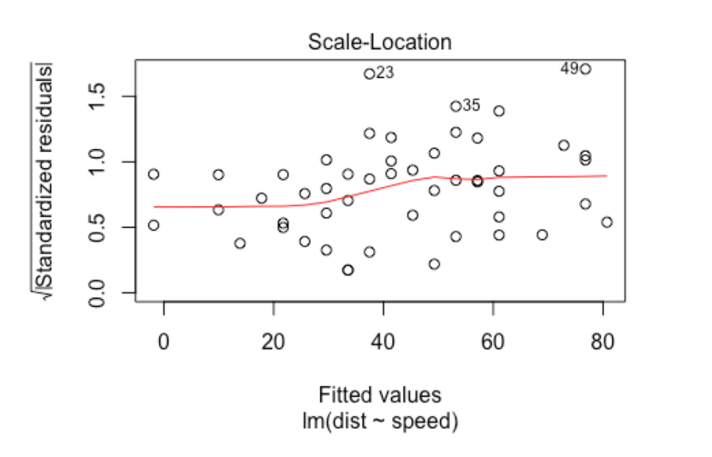

```{r setup, include=FALSE}
knitr::opts_chunk$set(
	echo = TRUE,
	message = FALSE,
	warning = FALSE
)

require(tidyverse)
require(broom)
```

```{r xaringanExtra-clipboard, echo=FALSE}
# to install
# devtools::install_github("gadenbuie/xaringanExtra")

xaringanExtra::use_clipboard()
```

# **What will we learn?**

You'll learn the basics of this popular statistical model, what regression is, and how linear and logistic regressions works and see the differences. You'll learn how to fit simple linear regression models with numeric and categorical explanatory variables, and how to describe the relationship between the response and explanatory variables using the coefficients estimated.

All this material was created from Datacamp with few adjusts made by me. See the course [here](https://app.datacamp.com/learn/courses/introduction-to-regression-in-r)

## Visualizing two variables

Before you can run ANY statistical models, it's usually a good idea to visualize your dataset. Seriously, study your dataset before anything. We'll look at the relationship between house price per area and the number of nearby convenience stores, using the Taiwan real estate dataset.

One challenge in this dataset is that the number of convenience stores contains integer data, causing points to overlap. To solve this, you will make the points transparent or jitter. In this notebook we are using `tidyverse` and `broom`.

```{r}
# Import dataset
tmp_file <- tempfile()
link = 'https://assets.datacamp.com/production/repositories/5759/datasets/bbfad1cf04348017143fef58b0b0f3f9b8b5bf99/taiwan_real_estate.fst'
curl::curl_download(link, tmp_file, mode="wb")
taiwan_real_estate <- fst::read_fst(tmp_file)
head(taiwan_real_estate)
```

Let´s see the behavior of the data:

```{r fig.show="hold", out.width="33%"}
par(mfrow = c(1,3))

# Draw a scatter plot of n_convenience vs. price_twd_msq
ggplot(taiwan_real_estate, 
       aes(x = n_convenience, y = price_twd_msq)) + 
       geom_point() +
       ggtitle('Plot sem especificação')

# Make points 50% transparent
ggplot(taiwan_real_estate, 
       aes(n_convenience, price_twd_msq)) +
       geom_point(alpha = 0.5) + 
       ggtitle('Plot com alpha = 0.5')

# Add a linear trend line without a confidence ribbon
ggplot(taiwan_real_estate, 
       aes(n_convenience, price_twd_msq)) +
       geom_point(alpha = 0.5) +
       geom_smooth(method = 'lm') +
       ggtitle('Plot com alpha e com reta de regressão')
```

Scholarly scatter plotting! Scatter plots are the standard way to visualize the relationship between two numeric variables, and `ggplot` makes adding linear trend lines easy.

## Estimate the intercept and slope

Linear regression models always fit a straight line to the data. Straight lines are defined by two properties: their `intercept` and their `slope`. We´ll use linear regression with the function `lm()`.

While `ggplot` can display a linear regression trend line using geom_smooth(), it doesn't give you access to the intercept and slope as variables, or allow you to work with the model results as variables. That means that sometimes you'll need to run a linear regression yourself.

Run a linear regression `lm(.)` with `price_twd_msq` as the response variable, `n_convenience` as the explanatory variable, and `taiwan_real_estate` as the dataset.

See how to do that:

```{r}
# Run a linear regression of price_twd_msq vs. n_convenience
lm(price_twd_msq~ n_convenience, data= taiwan_real_estate)

```

The intercept is positive, so a house with no convenience stores nearby still has a positive price. The coefficient for convenience stores is also positive, this means that the number of nearby convenience stores increases, so does the price of the house.

### Visualizing numeric vs. categorical

If the explanatory variable is categorical, the scatter plot that you used before to visualize the data doesn't make sense. Instead, we draw a histogram for each category.

Let´s investigate the variable house_age_years, it is a categorical.

```{r, out.width="100%", fig.height = 2}
# Using taiwan_real_estate, plot price_twd_msq
ggplot(taiwan_real_estate, aes(price_twd_msq)) +
  # Make it a histogram with 10 bins
  geom_histogram(bins = 10) +
  # Facet the plot so each house age group gets its own panel
  facet_wrap(vars(house_age_years))
```

See the summary:

```{r}
summary_stats <- taiwan_real_estate %>% 
  # Group by house age
  group_by(house_age_years) %>% 
  # Summarize to calculate the mean house price/area
  summarise(mean_by_group = round(mean(price_twd_msq),3))

# See the result
summary_stats
```

Let´s run a linear model and observe the coefficients returned by the model.

```{r}
# Run a linear regression of price_twd_msq vs. house_age_years
mdl_price_vs_age <- lm(
  price_twd_msq ~ house_age_years, 
  data=taiwan_real_estate)

# See the result
mdl_price_vs_age
```

We need to simplify our analysis, we should run a linear model without intercept, see below:

```{r}
# Update the model formula to remove the intercept
mdl_price_vs_age_no_intercept <- lm(
  price_twd_msq ~ house_age_years + 0, 
  data = taiwan_real_estate
)

# See the result
mdl_price_vs_age_no_intercept
```

Observe this results are the same we had in summarise above.

### Making predictions

```{r}
# From previous steps
explanatory_data <- tibble(
  n_convenience = 0:10
)

# Run the model
mdl_price_vs_conv <- lm(price_twd_msq~ n_convenience, data= taiwan_real_estate)


# Edit this, so predictions are stored in prediction_data
prediction_data <- 
    explanatory_data %>% 
      mutate(
        price_twd_msq = predict(mdl_price_vs_conv, explanatory_data)
      )

# See the result
head(prediction_data)

```

Let´s visualize the model within data:

```{r, fig.align = 'center'}
# Add to the plot
ggplot(taiwan_real_estate, aes(n_convenience, price_twd_msq)) +
  geom_point() +
  geom_smooth(method = "lm", se = FALSE) +
  # Add a point layer of prediction data, colored yellow
  geom_point(data = prediction_data,
             color = 'yellow', size = 3)
```

### Extracting model elements

The variable returned by `lm(.)` that contains the model object has many elements. In order to perform further analysis on the model results, you need to extract the useful bits of it. The model coefficients, the fitted values, and the residuals are perhaps the most important bits of the linear model object.

```{r}
# Get the model coefficients of mdl_price_vs_conv
coefficients(mdl_price_vs_conv)
```

```{r}
# Get the fitted values of mdl_price_vs_conv
head(fitted(mdl_price_vs_conv))
```

```{r}
# Get the residuals of mdl_price_vs_conv
head(residuals(mdl_price_vs_conv))
```

```{r}
# Print a summary of mdl_price_vs_conv
summary(mdl_price_vs_conv)
```

### Using broom

Many programming tasks are easier if you keep all your data inside data frames. The broom package contains functions that decompose models into three data frames: one for the coefficient-level elements (the coefficients themselves, as well as p-values for each coefficient), the observation-level elements (like fitted values and residuals), and the model-level elements (mostly performance metrics).

The functions in broom are generic. That is, they work with many model types, not just linear regression model objects. They also work with logistic regression model objects and many other types of model.

```{r}
# Get the coefficient-level elements of the model
broom::tidy(mdl_price_vs_conv)
```

```{r}
# Get the observation-level elements of the model
head(broom::augment(mdl_price_vs_conv))
```

```{r}
# Get the model-level elements of the model
broom::glance(mdl_price_vs_conv)
```

### Regression to the mean

The notion of regression to the mean was first worked by Sir Francis Galton. In any series with complex phenomena that are dependent on many variables, where chance is envolved, extreme outcomes tend to be followed by more moderate ones.

> "Regression to the mean is not a natural law. Merely a statistical tendency. And it may take a long time before it happens." --- Peter Bevelin

For example, our performance always varies around some average true performance. Extreme performance tends to get less extreme the next time. Why? Testing measurements can never be exact. All measurements are made up of one true part and one random error part. When the measurements are extreme, they are likely to be partly caused by chance. Chance is likely to contribute less on the second time we measure performance.

### Transforming variables

#### Transforming the explanatory variable

If there is no straight line relationship between the response variable and the explanatory variable, it is sometimes possible to create one by transforming one or both of the variables. Here, you'll look at transforming the explanatory variable.

You'll take another look at the Taiwan real estate dataset, this time using the distance to the nearest MRT (metro) station as the explanatory variable. You'll use code to make every commuter's dream come true: shortening the distance to the metro station by taking the square root.

```{r fig.show="hold", out.width="50%"}
par(mfrow = c(1,2))

# Run the code to see the plot
ggplot(taiwan_real_estate, aes(dist_to_mrt_m, price_twd_msq)) +
  geom_point() +
  geom_smooth(method = "lm", se = FALSE) + 
  ggtitle("Plot with the original variables")


# Edit so x-axis is square root of dist_to_mrt_m
ggplot(taiwan_real_estate, aes(sqrt(dist_to_mrt_m), price_twd_msq)) +
  geom_point() +
  geom_smooth(method = "lm", se = FALSE) + 
  ggtitle("Plot with the transformed explanatory variable")

```

```{r, fig.align = 'center'}
# Run a linear regression of price_twd_msq vs. 
# square root of dist_to_mrt_m using taiwan_real_estate
mdl_price_vs_dist <- lm(
  price_twd_msq ~ sqrt(dist_to_mrt_m), 
  data = taiwan_real_estate
)

# Use this explanatory data
explanatory_data <- tibble(
  dist_to_mrt_m = seq(0, 80, 10) ^ 2
)

# Use mdl_price_vs_dist to predict explanatory_data
prediction_data <- explanatory_data %>% 
  mutate(
    price_twd_msq = predict(mdl_price_vs_dist, explanatory_data)
  )

# See the graphic with transformed variable
ggplot(taiwan_real_estate, aes(sqrt(dist_to_mrt_m), price_twd_msq)) +
  geom_point() +
  geom_smooth(method = "lm", se = FALSE) +
  # Add points from prediction_data, colored green, size 5
  geom_point(data=prediction_data, color = 'green', size = 5)
```

When we have most of points near by 0, we can use `sqrt(.)` function to transform variables or some transformation with power between 0 and 1.

#### Transforming the response variable too

The response variable can be transformed too, but this means you need an extra step at the end to undo that transformation. That is, you "back transform" the predictions.

Let´s work with another data set, a marketing data: Conversion!!! Now The first step of the digital advertising workflow: spending money to buy ads, and counting how many people see them (the "impressions"). The next step is determining how many people click on the advert after seeing it.

```{r}
# Import data
tmp_file <- tempfile()
link2 = 'https://assets.datacamp.com/production/repositories/5759/datasets/aa7c64d2ce2b76bcef5da61d5f7e7128b7f0cb8e/ad_conversion.fst'
curl::curl_download(link2, tmp_file, mode="wb")
ad_conversion <- fst::read_fst(tmp_file)
head(ad_conversion)
```

How it seems the plot:

```{r fig.show="hold", out.width="50%"}
par(mfrow = c(1,2))

# Run the code to see the plot
ggplot(ad_conversion, aes(n_impressions, n_clicks)) +
  geom_point() +
  geom_smooth(method = "lm", se = FALSE)


# Edit to raise x, y aesthetics to power 0.25
ggplot(ad_conversion, aes(I(n_impressions^0.25), I(n_clicks^0.25))) +
  geom_point() +
  geom_smooth(method = "lm", se = FALSE)
```

```{r}
# Run a linear regression of n_clicks to the power 0.25 vs. 
# n_impressions to the power 0.25 using ad_conversion
mdl_click_vs_impression <- lm(
  I(n_clicks ^ 0.25) ~ I(n_impressions ^ 0.25),
  data = ad_conversion)

mdl_click_vs_impression
```

```{r}
# From previous step

# Use this explanatory data
explanatory_data <- tibble(
  n_impressions = seq(0, 3e6, 5e5)
)

# Make prediction
prediction_data <- explanatory_data %>% 
  mutate(
    # Use mdl_click_vs_impression to predict n_clicks ^ 0.25
    n_clicks_025 = predict(mdl_click_vs_impression, explanatory_data),
    # Back transform to get n_clicks
    n_clicks = round(predict(mdl_click_vs_impression, explanatory_data)^4,0)
  )

# See the prediction
prediction_data
```

See that `n_clicks_025` seen to be unreasonable prediction. Let´s see the plot.

```{r, fig.align = 'center'}
ggplot(ad_conversion, aes(n_impressions ^ 0.25, n_clicks ^ 0.25)) +
  geom_point() +
  geom_smooth(method = "lm", se = FALSE) +
  # Add points from prediction_data, colored green
  geom_point(data = prediction_data, color = 'yellow', size = 3)
```

# **Assessing model fit**

## Coefficient of determination

The coefficient of determination is a measure of how well the linear regression line fits the observed values. For simple linear regression, it is equal to the square of the correlation between the explanatory and response variables.

```{r}
mdl_click_vs_impression_orig <- lm(
  n_clicks ~ n_impressions,
  data = ad_conversion)

summary(mdl_click_vs_impression_orig)
```

```{r}
mdl_click_vs_impression_trans <- lm(
  I(n_clicks ^ 0.25) ~ I(n_impressions ^ 0.25),
  data = ad_conversion)

summary(mdl_click_vs_impression_trans)
```

```{r}
# Get coeff of determination for mdl_click_vs_impression_orig
mdl_click_vs_impression_orig %>% 
  # Get the model-level details
  glance() %>% 
  # Pull out r.squared
  pull(r.squared)
  # Pull out sigma
  # pull(sigma)
```

```{r}
# Do the same for the transformed model
mdl_click_vs_impression_trans %>% 
  # Get the model-level details
  glance() %>% 
  # Pull out r.squared
  pull(r.squared)
  # Pull out sigma
  # pull(sigma)

```

## Evaluate the model

1.  Residuals vs. Fitted value: a "residuals versus fits plot" is the most frequently created plot. It is a scatter plot of residuals on the y axis and fitted values (estimated responses) on the x axis. The plot is used to detect non-linearity, unequal error variances, and outliers.
2.  Q-Q plot of residuals: QQ-plots are ubiquitous in statistics. Most people use them in a single, simple way: fit a linear regression model, check if the points lie approximately on the line, and if they don't, your residuals aren't Gaussian. This implies that for small sample sizes, you can't assume your estimator $\hat{\beta}$ is Gaussian either, so the standard confidence intervals and significance tests are invalid. However, it's worth trying to understand how the plot is created in order to characterize observed violations.
3.  Scale-location: The scale-location plot is very similar to residuals vs fitted, but simplifies analysis of the homoskedasticity assumption. It takes the square root of the absolute value of standardized residuals instead of plotting the residuals themselves. Recall that homoskedasticity means constant variance in linear regression.

See the picture above:



We want to check two things:

1.  That the **red line is approximately horizontal**. Then the average magnitude of the standardized residuals isn't changing much as a function of the fitted values.
2.  That the **spread around the red line** doesn't vary with the fitted values. Then the variability of magnitudes doesn't vary much as a function of the fitted values.

```{r}
library(ggfortify)
# Plot the three diagnostics for mdl_price_vs_conv
autoplot(
    mdl_price_vs_conv,
    which = 1:3,
    nrow = 2,
    ncol = 2
)
```

#### Leverage

Leverage measures how unusual or extreme the explanatory variables are for each observation. Very roughly, a high leverage means that the explanatory variable has values that are different to other points in the data set. In the case of simple linear regression, where there is only one explanatory value, this typically means values with a very high or very low explanatory value.

```{r}
mdl_price_vs_dist %>% 
  # Augment the model
  augment() %>% 
  # Arrange rows by descending leverage
  arrange(desc(.hat)) %>% 
  # Get the head of the dataset
  head()
```

#### Influence

Influence measures how much a model would change if each observation was left out of the model calculations, one at a time. That is, it measures how different the prediction line would look if you ran a linear regression on all data points except that point, compared to running a linear regression on the whole data set.

The standard metric for influence is Cook's distance, which calculates influence based on the size of the residual and the leverage of the point.

```{r}
mdl_price_vs_dist %>% 
  # Augment the model
  augment() %>% 
  # Arrange rows by descending Cook's distance
  arrange(desc(.cooksd)) %>% 
  # Get the head of the dataset
  head()
```

#### Extracting leverage and influence

```{r}
# Plot the three outlier diagnostics for mdl_price_vs_conv
    autoplot(
        mdl_price_vs_dist,
        which = 4:6,
        nrow = 2,
        ncol = 2
    )
```

# **Simple logistic regression**

## Visualizing linear and logistic models

As with linear regressions, ggplot2 will draw model predictions for a logistic regression without you having to worry about the modeling code yourself. To see how the predictions differ for linear and logistic regressions, try drawing both trend lines side by side. Spoiler: you should see a linear (straight line) trend from the linear model, and a logistic (S-shaped) trend from the logistic model.

```{r}
# Import data
tmp_file <- tempfile()
link3 = 'https://assets.datacamp.com/production/repositories/5759/datasets/ef75a6144e6fd0b32f1aac51a12bb0d177f0a9f5/churn.fst'
curl::curl_download(link3, tmp_file, mode="wb")
churn <- fst::read_fst(tmp_file)
head(churn)
```

```{r}
plt_churn_vs_relationship <- 
ggplot(churn, aes(time_since_first_purchase, has_churned)) +
  geom_point() +
  geom_smooth(method = "lm", se = FALSE, color = "red") +
  # Add a glm trend line, no std error ribbon, binomial family
  geom_smooth(
    method = 'glm',
    method.args = list(family = binomial),  
    se = FALSE
    )

plt_churn_vs_relationship
```

## Logistic regression with glm()

Linear regression and logistic regression are special cases of a broader type of models called generalized linear models ("GLMs"). A linear regression makes the assumption that the residuals follow a Gaussian (normal) distribution. By contrast, a logistic regression assumes that residuals follow a binomial distribution.

```{r}
# Fit a logistic regression of churn vs. 
# length of relationship using the churn dataset
mdl_churn_vs_relationship <- 
    glm(has_churned ~ time_since_first_purchase,
        data = churn, family = binomial)

# See the result
mdl_churn_vs_relationship
```

### Probabilities

There are four main ways of expressing the prediction from a logistic regression model -- we'll look at each of them over the next four exercises. Firstly, since the response variable is either "yes" or "no", you can make a prediction of the probability of a "yes". Here, you'll calculate and visualize these probabilities.

```{r}
# Create a explonatory 
explanatory_data <- tibble(time_since_first_purchase = seq(-1.5, 4, by = 0.25))


# Make a data frame of predicted probabilities
prediction_data <- explanatory_data %>% 
  mutate(
    has_churned = predict(
      mdl_churn_vs_relationship, 
      explanatory_data,
      type = 'response'
    )
  )

# See the result
prediction_data
```

Update the plot:

```{r}
# Update the plot
plt_churn_vs_relationship +
  # Add points from prediction_data, colored yellow, size 2
  geom_point(
    data = prediction_data,
    color = 'yellow',
    size = 2
  )
```

### Most likely outcome

When explaining your results to a non-technical audience, you may wish to side-step talking about probabilities and simply explain the most likely outcome. That is, rather than saying there is a 60% chance of a customer churning, you say that the most likely outcome is that the customer will churn. The trade-off here is easier interpretation at the cost of nuance.

```{r}
# Update the data frame
prediction_data <- explanatory_data %>% 
  mutate(   
    has_churned = predict(mdl_churn_vs_relationship, explanatory_data, type = "response"),
    # Add the most likely churn outcome
    most_likely_outcome = round(has_churned)
  )

# See the result
prediction_data
```

Now, let´s to update the plot with the most_likely_outcome, within 0 or 1.

```{r}
# Update the plot
plt_churn_vs_relationship +
  # Add most likely outcome points from prediction_data, 
  # colored yellow, size 2
  geom_point(aes(y = most_likely_outcome),
             data = prediction_data,
             color = 'yellow',
             size = 2)
```

### Odds ratio

Odds ratios compare the probability of something happening with the probability of it not happening. This is sometimes easier to reason about than probabilities, particularly when you want to make decisions about choices. For example, if a customer has a 20% chance of churning, it maybe more intuitive to say "the chance of them not churning is four times higher than the chance of them churning".

```{r}
# Update the data frame
prediction_data <- explanatory_data %>% 
  mutate(   
    has_churned = predict(
      mdl_churn_vs_relationship, explanatory_data, 
      type = "response"
    ),
    # Add the odds ratio
    odds_ratio = has_churned/ (1-has_churned)
  )

# See the result
prediction_data
```

```{r}
# Using prediction_data, plot odds_ratio vs. time_since_first_purchase
ggplot(prediction_data, aes(time_since_first_purchase, odds_ratio)) +
  # Make it a line plot
  geom_line() +
  # Add a dotted horizontal line at y = 1
  geom_hline(yintercept = 1, linetype = 'dotted')
```

### Log odds ratio

One downside to probabilities and odds ratios for logistic regression predictions is that the prediction lines for each are curved. This makes it harder to reason about what happens to the prediction when you make a change to the explanatory variable. The logarithm of the odds ratio (the "log odds ratio") does have a linear relationship between predicted response and explanatory variable. That means that as the explanatory variable changes, you don't see dramatic changes in the response metric - only linear changes.

Since the actual values of log odds ratio are less intuitive than (linear) odds ratio, for visualization purposes it's usually better to plot the odds ratio and apply a log transformation to the y-axis scale.

```{r}
# Update the data frame
prediction_data <- explanatory_data %>% 
  mutate(   
    has_churned = predict(mdl_churn_vs_relationship, explanatory_data, type = "response"),
    odds_ratio = has_churned / (1 - has_churned),
    # Add the log odds ratio from odds_ratio
    log_odds_ratio = log(odds_ratio),
    # Add the log odds ratio using predict() "dont use type"
    log_odds_ratio2 = predict(mdl_churn_vs_relationship, explanatory_data)
  )

# See the result
prediction_data
```

```{r}
# Update the plot
ggplot(prediction_data, aes(time_since_first_purchase, odds_ratio)) +
  geom_line() +
  geom_hline(yintercept = 1, linetype = "dotted") + 
  # Use a logarithmic y-scale
  scale_y_log10()  
```

### Calculating the confusion matrix

A *confusion matrix* (occasionally called a *confusion table*) is the basis of all performance metrics for models with a categorical response (such as a logistic regression). It contains the counts of each actual response-predicted response pair. In this case, where there are two possible responses (churn or not churn), there are four overall outcomes.

1.  The customer churned and the model predicted that.

2.  The customer churned but the model didn't predict that.

3.  The customer didn't churn but the model predicted they did.

4.  The customer didn't churn and the model predicted that.

```{r}
# Get the actual responses from the dataset
actual_response <- churn$has_churned

# Get the "most likely" responses from the model
predicted_response <- round(fitted(mdl_churn_vs_relationship))

# Create a table of counts
outcomes <- table(predicted_response, actual_response)

# See the result
knitr::kable(outcomes)
```

```{r}
# Convert outcomes to a yardstick confusion matrix
confusion <- yardstick::conf_mat(outcomes)

# Plot the confusion matrix
autoplot(confusion)
```

```{r}
# Get performance metrics for the confusion matrix
summary(confusion, event_level = "second")
```

# **Reference**

-   <https://app.datacamp.com/learn/courses/introduction-to-regression-in-r>
-   <https://fs.blog/regression-to-the-mean/>
-   <https://boostedml.com/2019/03/linear-regression-plots-how-to-read-a-qq-plot.html>
-   <https://boostedml.com/2019/03/linear-regression-plots-scale-location-plot.html>
-   <https://online.stat.psu.edu/stat462/node/117/#:~:text=When%20conducting%20a%20residual%20analysis,unequal%20error%20variances%2C%20and%20outliers.>
